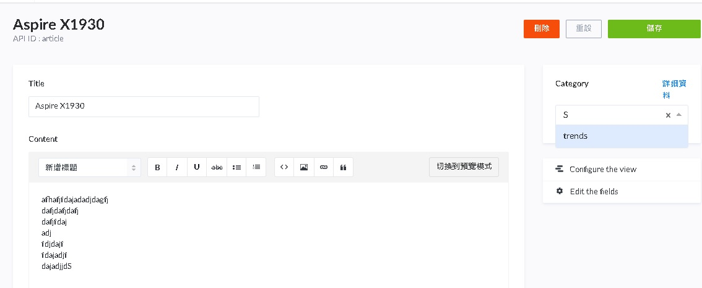

# Strapi application
## Start Strapi app
---
$ yarn create strapi-app backend --quickstart --no-run

$ cd backend ; yarn strapi install graphql

$ npm run develop 


## setting data
---
@ http://localhost:1337/admin/plugins/content-type-builder
1. Create 'Category' by Add New 'Collection'
You may want to assign a category to your article (news, trends, opinion). You are going to do this by creating another content type in Strapi.

* Create a 'Category' content type with the following field
'name' with type 'Text' , and give 3 entries 


2. Create a new field in the 'Article' content type
Strapi relational fields
* title with type Text (required)
* content with type Rich Text (required)
* image with type Media (Single image) and (required)
* published_at with type date (required)

3.
Add Relation Category has many Articles like below:


4. Click on the Roles & Permission and click on the public role. And check the 'category' 'find' and 'findone' routes and save.
Now you'll be able to select a category for your article in the right sidebox.


5. give article entry



## get date : 
---
method 1 : 

GET http://localhost:1337/articles

method 2 : (by graphql)
```
POST http://localhost:1337/graphql
body : 
query Articles {
    articles {
        title
        content
        image {
            url
        }
        published_at
    }
}

response : 
{
    "data": {
        "articles": [
            {
                "title": "Aspire X1930",
                "content": "afhafjfdajadadjdagfj\ndafjdafjdafj\ndafjfdaj\nadj\nfdjdajf\nfdajadjf\ndajadjjdS",
                "image": [
                    {
                        "url": "/uploads/photo_2020_08_28_10_25_30_ffac44377f.jpg"
                    },
                    {
                        "url": "/uploads/photo_2020_09_02_08_44_52_918ef42f80.jpg"
                    }
                ],
                "published_at": "2020-09-01"
            }
        ]
    }
}
```

## Start frontend React app.
---
```
$ yarn create react-app frontend
$ cd frontend
$ yarn add react-router-dom
$ yarn add apollo-boost @apollo/react-hooks graphql react-apollo
$ vim .env
REACT_APP_BACKEND_URL="http://localhost:1337"
$ yarn start

@ http://localhost:3000/
```


ref : 
https://strapi.io/blog/build-a-blog-with-react-strapi-and-apollo


